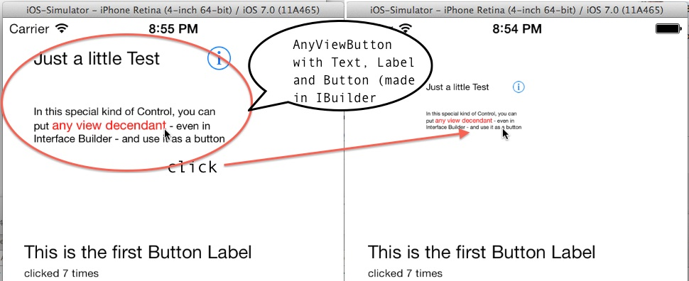

AnyViewButton
=============

A UIView descendant UIControl for iOS that can be used to combine multiple controls like labels and images and whatever and that animates the click and gives back a delegate event ... Simple demo (with Interface Builder) included

It´ simple to use. Just include the control´ header file

<code>
#import "anyViewButton.h";
</code>

create an instance

<code>
  anyViewButton *avButton = [[anyViewButton alloc] initWithFrame:CGRectMake(10, 200, 240, 100)];
</code>

and add it to your view

<code>
  [self.view addSubview:avButton];
</code>

then you can add whatever view as subview of avButton (as you would with a normal UIView)

set the factorForInset (depth of the shrinking when pressed) from 1.0 (no shrinking) to 0.00001 (just a pix ;-)

<code>
    avButton.factorForInset = 0.9;
</code>

And of course the animation duration when pressing and releasing the pressed views... in seconds.
<code>
    avButton.durationForInset = 0.4;
    avButton.durationForInset = 0.1;
</code>

Then all you have to do is setting the delegate

<code>
    avButton.delegate = self; // now the click calls the STEP 3 below
</code>

and handle it in the delegate method

<code>
-(void) tapAnyViewButtonInside:(id)sender {

    NSLog(@"You tapped the anyViewButton ");

}
</code>
That´s it ;-)

