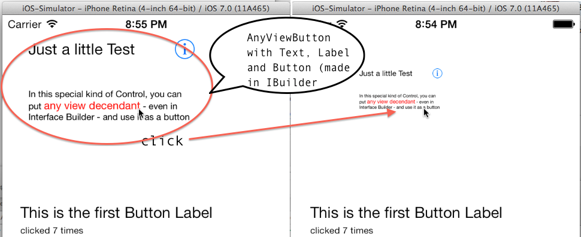

AnyViewButton
=============

A UIView Control for iOS that can be used to combine multiple controls like labels and images and whatever and that animates the click and gives back a delegate event ... Simple demo (with Interface Builder) included

